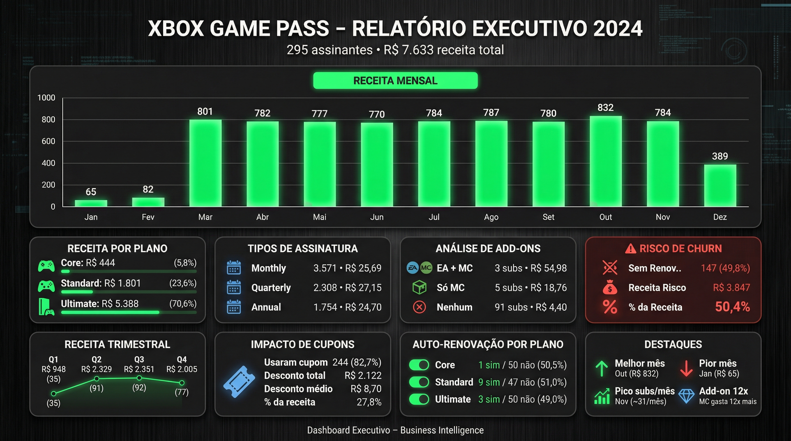

# 📊 Sales Dashboard in Excel

## 📸 Executive Dashboard Preview

Below is the executive visual representation of the Sales Performance Dashboard developed for the Xbox Game Pass 2024 analysis.

This preview demonstrates:

- Strategic KPI structuring  
- Executive-level layout organization  
- Business Intelligence visualization standards  
- Data-driven performance analysis  
- SaaS-style dashboard aesthetics  

The dashboard was designed to consolidate all metrics into a single landscape executive view, ensuring clarity, symmetry, and professional reporting standards.

## 🧠 Project Overview

This project consists of the development of a Sales Dashboard built entirely in Microsoft Excel, designed to transform raw sales data into clear, strategic, and decision-oriented visual insights.

The objective is to demonstrate how Excel can be used as a powerful Business Intelligence tool for data organization, analysis, and visualization.

---

## 🎯 Purpose

The dashboard was created to:

- Monitor overall sales performance  
- Analyze revenue trends over time  
- Compare product performance  
- Evaluate regional results  
- Support data-driven decision making  

---

## 📂 Dataset

The dataset contains structured sales information, including:

- Order Date  
- Product Name  
- Category  
- Quantity Sold  
- Revenue  
- Region  

File used:

base.xlsx

---

## 🛠 Tools & Techniques Applied

- Microsoft Excel  
- Pivot Tables  
- Pivot Charts  
- Data Segmentation (Slicers)  
- Conditional Formatting  
- Structured Tables  
- KPI Calculations  
- Excel Functions (SUM, IF, XLOOKUP/VLOOKUP, AVERAGE, etc.)

---

## 📈 Dashboard Features

The dashboard includes:

- Total Revenue KPI  
- Total Units Sold  
- Performance by Product  
- Performance by Region  
- Time-based Sales Analysis  
- Interactive filters for dynamic exploration  

All visualizations update automatically when filters are applied.

---

## ▶️ How to Use

1. Download the `.xlsx` file from this repository  
2. Open it using Microsoft Excel (2016 or newer recommended)  
3. Navigate to the Dashboard sheet  
4. Use the slicers to interact with the data  
5. Update the base dataset if you wish to simulate new scenarios  

---

## 📌 Project Structure

├── base.xlsx

├── Dashboard_Sistema_Pronto.xlsx

└── README.md

---

## 🚀 Learning Outcome

This project reinforces the importance of:

- Data organization  
- Visual communication  
- KPI structuring  
- Analytical thinking  
- Business-oriented reporting  

It demonstrates how Excel can be leveraged as a practical Business Intelligence solution.

---

## 👨‍💻 Author

**Matheus Florindo de Deus**  
Developed as part of the DIO challenge.
